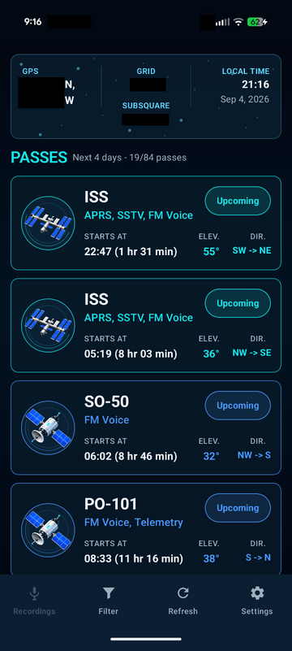
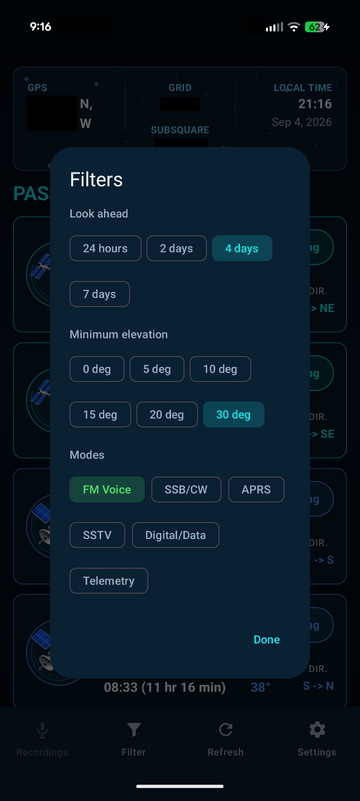
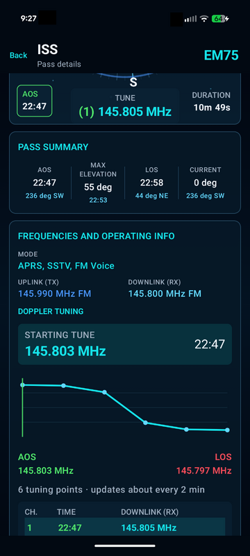
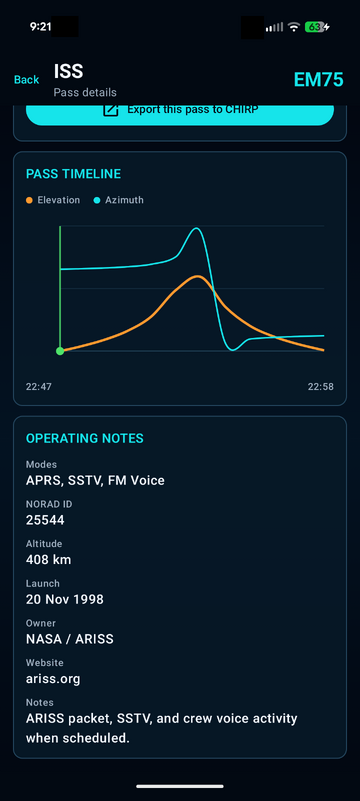
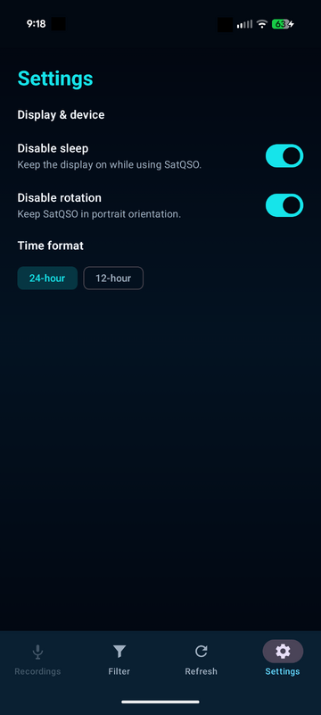

# SatQSO

SatQSO is an Android pass planner for amateur-radio satellites. It calculates passes on-device from the observer location and current TLE data.

## Features

- Orekit pass prediction with interpolated AOS and LOS boundaries.
- AMSAT and CelesTrak TLE feeds, a 12-hour cache, and offline fallback.
- GPS, decimal-coordinate entry, and an OpenStreetMap location picker.
- Four- and six-character Maidenhead locators.
- Minimum-elevation, operating-mode, and 24-hour to 7-day filters.
- Cached pass list shown immediately on launch, with pull-to-refresh and live refresh status.
- Upcoming, active, and passed pass statuses with live countdowns.
- Compass-oriented sky path with live satellite position.
- Azimuth and elevation timeline.
- Doppler-corrected downlink tuning timeline with a live radar tune prompt and programmable time/frequency table.
- CHIRP-compatible CSV export for a pass's Doppler channels, including split uplink frequencies and PL tones; share it through Drive, email, or another Android app.
- Uplink, downlink, tone, mode, and satellite operating notes.
- Background TLE refresh through WorkManager.

## Screenshots

### Upcoming passes

<table>
  <tr>
    <td><a href="docs/screenshots/home.png"></a></td>
  </tr>
</table>

### Filters

[](docs/screenshots/filters.png)

### Pass details

<table>
  <tr>
    <td><a href="docs/screenshots/pass-detail.png"></a></td>
    <td><a href="docs/screenshots/pass-detail-middle.png"></a></td>
    <td><a href="docs/screenshots/pass-detail-bottom.png"></a></td>
  </tr>
</table>

### Settings

[](docs/screenshots/settings.png)

## Install

[Download the latest APK from GitHub Releases](https://github.com/linuxx/SatQSO/releases).

SatQSO requires Android 7.0 (API 24) or newer. Location permission enables GPS-based predictions; internet access updates TLE data. Cached passes and TLEs can be shown offline. GPS fixes older than one hour are refreshed when the app recalculates passes.

Tap the location panel to select a point on the map. `Reset to GPS` restores the device location. An amber `GPS • MODIFIED` label identifies a saved map location.

## Build

Requirements:

- JDK 11
- Android SDK platform 37
- Android Studio or the Android SDK command-line tools

Run the unit tests and build a debug APK:

```powershell
.\gradlew.bat :app:testDebugUnitTest
.\gradlew.bat :app:assembleDebug
```

Install the debug build on a connected device:

```powershell
.\gradlew.bat :app:installDebug
```

For a signed release, create an ignored `keystore.properties` file with the signing values and run:

```powershell
.\gradlew.bat :app:assembleRelease
```

APK output:

- Debug: `app/build/outputs/apk/debug/app-debug.apk`
- Release: `app/build/outputs/apk/release/app-release.apk`

Keep the release keystore and passwords backed up. The same key is required to publish app updates.

## Project Layout

- `data`: TLE sources, cache, repository, preferences, and refresh scheduling.
- `domain`: satellite models, parsing, and Orekit pass prediction.
- `location`: device location and orientation sensors.
- `ui`: Compose screens, state, formatting, and theme.
- `app/src/test`: domain, data, filter, and formatting tests.
