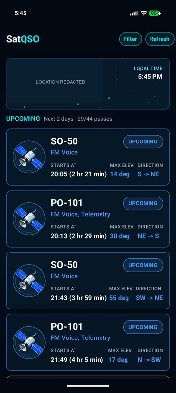
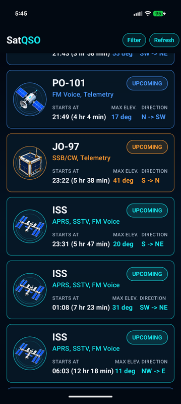
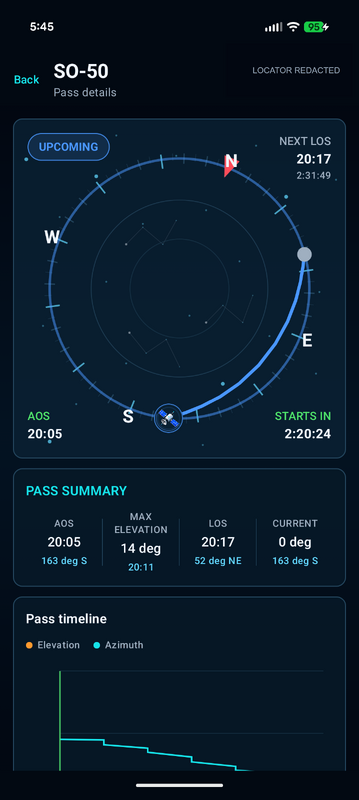
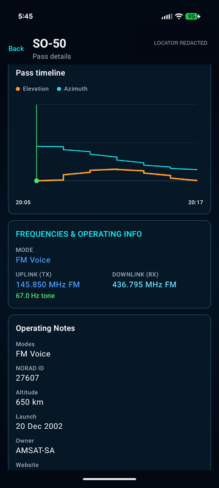

# SatQSO

SatQSO is an Android satellite-pass planner for amateur radio operators. It calculates visible passes from current or manually entered coordinates and presents satellite, timing, elevation, direction, frequency, and operating-mode details.

## Features

- Orekit-based pass prediction with accurate AOS and LOS boundaries.
- AMSAT and CelesTrak TLE data with a 12-hour cache and source fallback.
- Background TLE refresh through WorkManager.
- Offline fallback to the most recent cached orbital data.
- GPS location with manual latitude, longitude, and altitude fallback.
- Maidenhead locator and live local-time display.
- Minimum-elevation and operating-mode filters.
- Rolling upcoming-pass list for the next 24 hours, with configurable 24-hour, 2-day, 4-day, or 7-day look-ahead.
- Per-pass start time and live countdown on the home screen.
- Screen stays on while the app is open for pass monitoring.
- Pass detail view with satellite-specific radio information.
- Azimuth/elevation timeline in pass details.
- Device heading readout in the sky view when a rotation sensor is available.
- Live satellite position marker synchronized with the pass timeline.
- Pass-state countdown for upcoming, active, and completed passes.
- High-resolution launcher icon and dark space-themed UI.

## Screenshots

### Upcoming passes

The home screen shows only future passes in the selected rolling window. Each pass includes its local start time, live countdown, maximum elevation, and direction.

<table>
  <tr>
    <td><a href="docs/screenshots/home.png"></a></td>
    <td><a href="docs/screenshots/home-lower.png"></a></td>
  </tr>
</table>

### Look-ahead filters

The filter dialog supports 24 hours, 2 days, 4 days, and 7 days, along with elevation and operating-mode filters.

[](docs/screenshots/filters.png)

### Pass tracking

Pass details include a compass-oriented sky path, live satellite position, heading, countdown state, and elevation/azimuth timeline.

<table>
  <tr>
    <td><a href="docs/screenshots/pass-detail.png"></a></td>
    <td><a href="docs/screenshots/pass-detail-lower.png"></a></td>
    <td><a href="docs/screenshots/pass-detail-bottom.png"></a></td>
  </tr>
</table>

The screenshots use ImageMagick-redacted location fields for privacy. Click any thumbnail to view the full-size capture.

## Releases

The latest release APK is available from the [SatQSO releases](https://github.com/linuxx/SatQSO/releases) page.

## Requirements

- Android Studio or the Android SDK.
- JDK 11.
- Android SDK platform 37.
- A device or emulator running Android 7.0 (API 24) or newer.

The app needs location permission for GPS-based predictions and internet access to download current TLE data. Manual coordinates and cached TLEs allow it to remain useful without either service.

Tap the location summary on the home screen to choose a different point on the map. Tap **Use this location** to calculate passes from the pin, or **Reset to GPS** to return to the device location.

The location summary is amber and labeled `GPS • MODIFIED` whenever a saved map pin is active.

## Build

From the project directory:

```powershell
.\gradlew.bat testDebugUnitTest
.\gradlew.bat assembleDebug
```

For a distributable release build, create a local `keystore.properties` file with the signing values and run:

```powershell
.\gradlew.bat assembleRelease
```

The release APK is generated at `app/build/outputs/apk/release/app-release.apk`. Keep the release keystore and its passwords backed up; they are required for future app updates.

To install the debug build on a connected device:

```powershell
.\gradlew.bat installDebug
```

The generated APK is located at `app/build/outputs/apk/debug/app-debug.apk`.

## Project layout

- `app/src/main/java/.../data` — TLE caching, refresh scheduling, and pass data sources.
- `app/src/main/java/.../domain` — satellite models and Orekit prediction logic.
- `app/src/main/java/.../location` — GPS and manual location handling.
- `app/src/main/java/.../ui` — Compose screens, filters, theming, and formatting.
- `app/src/test` — unit tests for caching, prediction boundaries, filters, and location formatting.

## Orbital data

TLE data is fetched from AMSAT and CelesTrak. Cached data is considered fresh for 12 hours; when a network request fails, the app uses the newest available stale cache rather than failing immediately.
